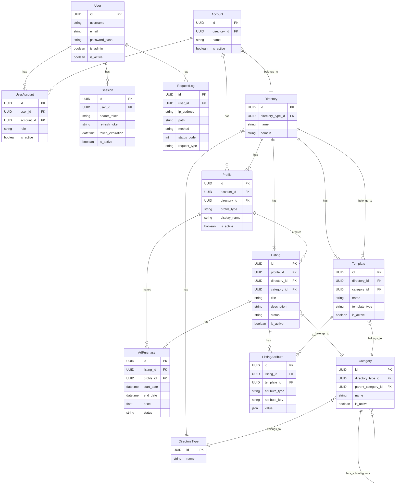

```mermaid
erDiagram
    User ||--o{ UserAccount : has
    User ||--o{ Session : has
    User ||--o{ RequestLog : has
    Account ||--o{ UserAccount : has
    Account ||--o{ Profile : has
    Account }|--|| Directory : belongs_to
    Directory ||--|{ Profile : has
    Directory ||--|{ Listing : has
    Directory ||--|{ Template : has
    Directory }|--|| DirectoryType : has
    Profile ||--o{ Listing : creates
    Profile ||--o{ AdPurchase : makes
    Listing }|--|| Category : belongs_to
    Listing ||--o{ ListingAttribute : has
    Listing ||--o{ AdPurchase : has
    Template }|--|| Category : belongs_to
    Template }|--|| Directory : belongs_to
    Template ||--o{ ListingAttribute : has
    Category }|--|| DirectoryType : belongs_to
    Category ||--o{ Category : has_subcategories

    User {
        UUID id PK
        string username
        string email
        string password_hash
        boolean is_admin
        boolean is_active
    }
    Account {
        UUID id PK
        UUID directory_id FK
        string name
        boolean is_active
    }
    UserAccount {
        UUID id PK
        UUID user_id FK
        UUID account_id FK
        string role
        boolean is_active
    }
    Profile {
        UUID id PK
        UUID account_id FK
        UUID directory_id FK
        string profile_type
        string display_name
        boolean is_active
    }
    Directory {
        UUID id PK
        UUID directory_type_id FK
        string name
        string domain
    }
    DirectoryType {
        UUID id PK
        string name
    }
    Listing {
        UUID id PK
        UUID profile_id FK
        UUID directory_id FK
        UUID category_id FK
        string title
        string description
        string status
        boolean is_active
    }
    ListingAttribute {
        UUID id PK
        UUID listing_id FK
        UUID template_id FK
        string attribute_type
        string attribute_key
        json value
    }
    Category {
        UUID id PK
        UUID directory_type_id FK
        UUID parent_category_id FK
        string name
        boolean is_active
    }
    Template {
        UUID id PK
        UUID directory_id FK
        UUID category_id FK
        string name
        string template_type
        boolean is_active
    }
    AdPurchase {
        UUID id PK
        UUID listing_id FK
        UUID profile_id FK
        datetime start_date
        datetime end_date
        float price
        string status
    }
    Session {
        UUID id PK
        UUID user_id FK
        string bearer_token
        string refresh_token
        datetime token_expiration
        boolean is_active
    }
    RequestLog {
        UUID id PK
        UUID user_id FK
        string ip_address
        string path
        string method
        int status_code
        string request_type
    }
```